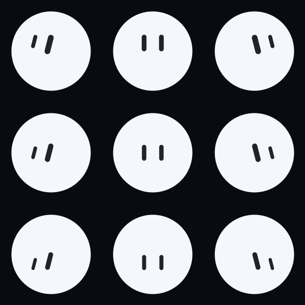

# bot-ux

A small, controllable Grok-inspired bot animation component for M5Stack devices.

It draws a minimal orb and two expressive eye marks into a
caller-provided [`M5Canvas`](https://docs.m5stack.com/en/arduino/m5stack/m5gfx)
sprite. The component never touches the display — the host creates the sprite,
drives `update()`/`draw()` each frame, and pushes the sprite when convenient.
That keeps it embeddable into both a watch (M5Stack StopWatch) and a touch tablet
(Core2) with no display coupling.

## Quick start

```cpp
#include <M5Unified.h>
#include <BotUx.h>

M5Canvas canvas(&M5.Display);
botux::BotUx bot;

void setup() {
  M5.begin();
  canvas.createSprite(M5.Display.width(), M5.Display.height());
  bot.begin(&canvas);
  bot.setBattery(87);
  bot.setBatteryVisible(false); // let the host own status UI
}

void loop() {
  M5.update();
  if (M5.BtnA.wasPressed()) bot.poke();   // surprise -> happy reaction
  bot.update(millis());
  bot.draw();
  canvas.pushSprite(0, 0);
}
```

## API (see `src/BotUx.h`)

- **Moods** — the original `Idle`, `Listening`, `Thinking`, `Speaking`, `Happy`,
  `Sad`, `Sleepy`, and `Surprised`, plus additive task states `Working`, `Waiting`,
  `Blocked`, `Done`, and append-only `Asleep` via `setMood()`.
- **Personalization** — `Style` holds the background, orb, eye, and status colors;
  eye mark style; silhouette style; eye scale; and blink rate. `Round` + `Oval`
  is the closest match to the default Grok visual language.
- **Expressions** — `setExpression()` selects `Neutral`, `Curious`, `Focused`,
  `Joy`, `Skeptical`, `Bashful`, `Wink`, `Dizzy`, or `Alarmed`, independently
  of lifecycle mood. `Auto` follows the mood. Pass a transition duration, or
  zero to switch directly on the next update.
- **Choreography** — `setAnimation()` selects `Calm`, `Curious`, `Orbit`,
  `Bounce`, `Glitch`, `Wave`, or `Sparkle`. `Auto` assigns distinct motion to
  each lifecycle state. `setAnimationSpeed()`, `setMotionAmount()`, and
  `setReducedMotion()` are suitable for device settings.
- **Status** — `setBattery`, `setSignal`, `setTime`, `setLabel`.
- **Interaction** — `poke()` (quick surprise→happy), `setTalking(bool)` to
  drive the speaking pulse, and `setMotion(tiltX, tiltY, shake)` for normalized
  IMU input.
- **Frame loop** — `update(nowMs)` then `draw()`.

The component renders into whatever canvas you give it and scales itself to
that canvas, so a bot can be a watch-face hero or a small command-deck tile.
Its draw path uses fixed stack locals and M5GFX primitives, with no per-frame
heap allocation.

The visual system follows xAI's published [Grok Bot design notes](https://x.ai/news/designing-grok-bot):
simple geometric avatars, expressive eyes, and avatar motion that carries state.
`Thinking` becomes three animated dots and `Blocked` becomes an exclamation;
ordinary character moods keep the recognizable orb-and-eye-pair anatomy.
The shared default uses a warm-white orb, dark graphite eye marks, and blue only
for status accents. `Waiting` has open patient eyes and a slow searching glance;
`Sleepy` settles into narrow eyes and a longer blink. `Asleep` closes the eyes
fully, breathes deeply, and drifts three fading z marks above the orb. The Neutral pose defines
the common eye spacing and upper-right placement for every expression.

The expanded control model was also informed by two public implementations:
[ngocdevv/grok-bot-emoji](https://github.com/ngocdevv/grok-bot-emoji) separates
controlled expression selection from motion and supports reduced motion, while
[nasawz/GrokBot](https://github.com/nasawz/GrokBot) separates persistent state,
shape, gaze, and transient commands. BotUx uses its own compact geometry and
timings for M5GFX; it does not embed their vector paths or extracted assets.

## Geometry and rendering

The September 2026 polish keeps expressions in one anatomical family: small
changes in openness, gaze, and lean carry curiosity and skepticism. Joy eases
into shallow rounded arches; Wink closes one eye continuously; Alarmed shortens
and rounds the same eye marks. Dizzy uses a slow pair sway. Face placement,
body stretch, and body translation ease in time rather than jumping at a mood
change. The Thinking dots and Blocked exclamation remain discrete status glyphs.

The default orb uses scanline coverage with four vertical samples at its
boundary, and the eye capsules use a distance-based one-pixel edge. Solid
interiors use horizontal spans; only the boundary mixes RGB565 colors. No
supersampled canvas, dynamic allocation, or render-target ownership is added.
M5GFX's installed `fillSmoothCircle`/`fillSmoothRoundRect` were inspected; the
local path also supports the animated elliptical silhouette and oblique pills.
`readPixel` returns RGB565, which is used directly when overlapping eye strokes
blend. RoundedSquare, Hexagon, and the small status glyphs retain native M5GFX
primitives; those alternate silhouettes do not yet share the ellipse AA path.

The restrained expression changes draw conceptual guidance from
[FluxGarage/RoboEyes](https://github.com/FluxGarage/RoboEyes), which separates
openness, position, curiosity, and automatic blinking. The longer gaze pauses
and separation of persistent expression from transient motion also follow the
public interface described by [nasawz/GrokBot](https://github.com/nasawz/GrokBot).
[blessonism/grok-icon-study](https://github.com/blessonism/grok-icon-study) is
another public motion-engine study; it explicitly excludes third-party geometry.
These references informed behavior, not copied drawing code or assets.

For a color picker, copy `bot.style()`, update its RGB565 `bodyColor`, `eyeColor`,
`bgColor`, or `accentColor`, then call `setStyle()`. Hosts own color selection
and persistence. For leisurely expression previews, use a 650–700 ms transition
and hold each pose for several seconds. IMU inputs are filtered over 240 ms at
normal motion; tilt displacement is about 5.5% of body radius horizontally and
4.2% vertically before the user's motion amount is applied.

## Integration in a PlatformIO project

```ini
lib_extra_dirs = ../../lib   ; from either device project in this repository
lib_deps =
  m5stack/M5Unified
  m5stack/M5GFX
```

## Host preview

`tools/host-preview/render.sh` compiles the real `BotUx.cpp` against a small
SVG-emitting `M5Canvas` stand-in. It generates source-derived 40, 72, and 200 px
mood sheets plus expression and animation pickers. `animation-player.html`
plays 60 real C++-rendered frames for every choreography, the automatic
lifecycle, expression transitions, and IMU motion. Assertions cover visibly
distinct choices, direct and eased transitions, IMU response, reduced motion,
and sparse-frame blink catch-up without claiming device raster fidelity.

The preview additionally checks RGB565 edge color coverage and face placement
at 72, 200, and 310 px, and emits `transitions.svg` with consecutive Joy/Wink
transition frames. Pixel rectangles are displayed without browser interpolation.

The same continuous pill geometry also runs at 40 px, including Joy and Wink in
Core2's toolbar/settings preview. An explicitly selected `Neutral` resets the
face to its baseline proportions while retaining the mood's body rhythm;
`Auto` retains Sleepy's narrow eyes and Waiting's patient searching face. The preview verifies this
reopening behavior at 40, 72, and 200 px and emits `expressions-40.svg`.

A parent-run isolated StopWatch benchmark (310 px orb, existing host app) measured
30.4 FPS after AA, with 16.73 ms drawing and 14.44 ms transfer, compared with the
previous 39 FPS / 8.7 ms drawing. This is a measured quality/performance tradeoff,
not a claim that antialiasing is free. Final application timing is tracked by the
device integration validation.

## Companion semantics (September 2026)

The name defaults to `Milo`. `setName()` copies up to `kNameMax` (16) ASCII
letters, digits, spaces, hyphens and apostrophes, strips other bytes and trims
outer spaces. Null/empty input resets to Milo. The host owns persistence and its
English-only name editor; the Bot owns the bounded copy.

`Language::English` and `Language::Chinese` select static UTF-8 labels through
`moodName`, `expressionName`, and `animationName`. `describe(buffer, capacity,
language)` writes a short natural description, for example `Milo is resting`,
`Milo feels dizzy`, `Milo is thinking`, or `Milo 正在思考`. While Idle, an explicitly
selected expression supplies the description; otherwise the effective mood
(including transient reactions) takes precedence. This keeps captions readable
without listing enum labels. Menu labels still use the static name helpers.
It returns the required byte count,
always terminates a nonempty buffer, and avoids cutting UTF-8 characters. Hosts
must provide an appropriate font; BotUx does not add font assets or render this
text automatically. Names remain English in either language.

`moodCount()` = 13, `expressionCount()` = 10 (including Auto), and
`animationCount()` = 8 (including Auto). All existing enum numeric values remain
unchanged. Hosts can independently iterate all **1,040 combinations** in a preview
Bot. `mood()`, `expression()`, `animation()` report selections;
`effectiveMood()` / `effectiveExpression()` report mood reactions and Auto's
resolved face. Thinking and Blocked retain their intentional silhouette
replacements, so a selected expression is preserved but not visible in those
moods. Preview Bot state must not overwrite actual host status.

`presetCount()` / `preset(index)` expose eight curated combinations. Indices wrap.
`applyPreset(index)` applies one; `nextPreset()` advances and returns the index;
`randomPreset()` returns a different preset using independent deterministic RNG
(seed with `seedBlink` for device variation). `resetToIdle()` clears reactions and
restores Idle / Auto / Auto. They preserve style, name, speed and motion settings.
Hosts map A to random, B to next and double B to reset, delaying single B until
the double-click window closes.

`gazeAt(x, y, holdMs=1800)` takes normalized canvas coordinates, with negative x
left, negative y up, each clamped to [-1,1]. Map a canvas-local tap as
`2*x/width-1`, `2*y/height-1`. Only persistent Idle accepts it. The target eases in,
expires using the same `millis()` clock as `update`, and then resumes wandering;
`clearGaze()` cancels it. It does not call `poke` or change mood. Idle gaze now has
24% radius horizontal and 20% vertical travel, independent of animation motion
amount, preserving the characteristic neutral eye arrangement.

### Eye coverage and validation

Joy is now a single swept quadratic curve. Twelve small chords approximate its
centerline with under 0.04 pixel flattening error at eyeRadius 24; each pixel
receives coverage from the union distance exactly once. Endcaps remain round,
and the neutral-to-Joy control points interpolate continuously. This removes
independent capsule alpha overlap and the old three-piece geometry's bumps.
At <=48px, the curve width is bounded to retain separation between the eyes.
The curve uses 240 bytes of fixed float arrays on the stack and no frame heap
allocation or extra framebuffer.

Source-derived previews (top: Neutral to Joy; bottom: Neutral to Wink; first
six frames plus part of the seventh, 100ms apart) capture the prior implementation
and this change using the same existing host preview renderer:


These are RGB565 coverage primitives rendered through the SVG host adapter,
not native device captures. Regenerate current source sheets with
`tools/host-preview/render.sh`; the durable PNGs preserve the before/after
comparison. The default rounded body and eye primitives are backed by real
RGB565 raster pixels; other shapes remain SVG approximations.

Validation on 2026-09-06: existing host checks pass; added checks exercise all 1,040
selector combinations, safe names, tiny UTF-8 buffers, preset transitions,
temporary tap gaze and expiry. A connected-component pixel check verifies two
continuous eye marks through 40 morph frames for all four eye styles at 40, 72,
and 200px (480 frames). It caught and fixed eyes touching at 40px.

Clang C++11 `-O2`, 500 draws, raster-backed host adapter with SVG recording
disabled: full Neutral/Joy draw at 40px **3.12/3.42 µs**, 72px **8.25/8.91 µs**,
200px **48.33/50.68 µs**. These isolate CPU/raster cost from SVG serialization and
are not ESP32 timings. The parent integration owns native frame/memory timing,
firmware builds, flashing and actual device captures.

## Direction and sustained motion (September 2026)

`GazeDirection { Auto=0, Center, Left, Right, Up, Down, UpLeft, UpRight,
DownLeft, DownRight }` is additive; every older
mood/expression/animation enum retains its value. `setGazeDirection()` stores the
selection and `gazeDirection()` reads it. `gazeDirectionCount()` and
`gazeDirectionName(value, language)` expose all ten stored choices, including compatibility Auto. Center is displayed
as Front / 正前. Diagonal Chinese labels are 左上 / 右上 / 左下 / 右下.
`explicitGazeDirectionCount()` returns **9** and `explicitGazeDirection(index)`
iterates exactly those nine user-facing directions without Auto (Center, Left,
Right, Up, Down, UpLeft, UpRight, DownLeft, DownRight). Device apps own persistence. Invalid
values fall back to Auto. Direction is retained by presets and resetToIdle.

Auto follows the mood/expression's gaze and adds a little wandering even to
stable explicit faces. A chosen direction replaces that gaze with a clear
left/right/up/down target and subtle drift around it. Explicit directions also
ease the expression's global eye-pair placement to the body center, so Curious's
rightward bias cannot cancel Left and an elevated face cannot cancel Down.
Center stays centered; eye shape, spacing, lean and rotation are retained.
Auto keeps the expression's original placement.
Temporary `gazeAt()` takes precedence in Idle and returns to the selected
direction when it expires. All autonomous gaze drift scales with motion amount
and reduced motion; explicit user direction/tap commands still work at zero.
The host preview additionally writes `gaze-directions.svg` from actual BotUx code.

Calm now has continuous slow sway and a small eye rotation in addition to
breathing. Choreography is more visible for stable expressions and at the
Watch's 0.55 motion setting; every curated preset keeps moving in late time
windows. Breathing, mood-specific pulses, Dizzy rotation and Thinking dot travel
now all respect motion amount and reduced motion. At zero, the pose remains
stable after easing settles (normal blinking is independent). Reduced motion
keeps a small amount of slower-looking travel instead of repeating full-size
motion. It does not change animation speed or erase an expression.

Thinking's three dots now use float centers and the same real RGB565 AA ellipse
coverage as the orb. Blocked's stem/dot also use float capsule/ellipse coverage
and follow body scale: the new time-window checks exposed its integer-only
position jumps, so breathing now remains visible even for this silhouette.
No extra framebuffer or frame allocation was introduced.

Added validation beyond the existing tests:

- All 1,040 mood/expression/animation combinations produce at least four distinct
  raster frames in each 3-second window starting at 10, 30 and 50 seconds. Blink
  is delayed beyond those windows, so entry morphs/blinks cannot make a frozen
  choreography pass. All sampled frames stay inside the canvas.
- All eight presets at the Watch's 0.55 motion amount produce at least eight
  distinct raster frames in windows starting at 10, 40 and 80 seconds.
- Left/right produce clearly separated eye positions; a temporary tap overrides
  direction and returns to it. Zero-motion stable frames are identical across
  all 13 moods with Dizzy/Orbit, after settling and with blinking delayed.
- Thinking coverage has more than 12 actual RGB565 colors across its three dots,
  rather than checking for an SVG circle instruction.
- On a four-second Calm sequence, aggregate RGB565 temporal difference is
  392,549 full motion versus 108,210 reduced (27.6%). This measures pixel-channel
  movement rather than merely counting different frame hashes.

`tools/host-preview/render.sh` passes with C++11 `-Wall -Wextra -Werror`.
Device integration owns native frame timing, screenshots and battery/persistence
acceptance; these host tests do not claim physical-device acceptance.

A native Listening/Curious Left preview exposed the previous cancellation between
expression placement and gaze offset. The direction regression now renders
**3,200 cases**: all ten moods that show eyes × ten expressions × four eye styles
× all eight cardinal/diagonal directions, first settling Auto then selecting the direction. The raster
eye-coverage bounding-box center must lie on the correct side of the raster body
center by at least 12% radius horizontally or 9% vertically. Using the bounding
box keeps Wink's different ink masses from being mistaken for pair movement.
All cases and the existing host suite pass; transitions retain the original
scalar easing rather than jumping when a direction is selected.

## Nine facing poses and Thinking travel

Direction is a continuous facing pose, not only a translated eye pair. Horizontal
turns compress eye spacing by up to 16%, scale the far/near eyes by up to 22%,
and give their strokes a mirrored slant. Vertical turns move the pair up/down
and slightly open/compress the eyes. Diagonals combine these with a small
perspective offset between the eye baselines. Front restores an upright,
balanced neutral pair. Expression-specific smile, wink and alarm geometry stays
on the same curved AA rendering path. Auto keeps its original behavior.

The directional pose weight and gaze vector ease together. A temporary `gazeAt`
uses exactly the same perspective and body-relative placement as an explicit
direction; expiration eases back to Auto or the selected direction. Explicit
directions/taps remain usable at motion zero; autonomous drift remains disabled.
No new buffers are allocated during rendering; the extra pose weight is a float.



The grid is Up-left / Up / Up-right, Left / Front / Right, Down-left / Down /
Down-right. This PNG is converted directly from the host adapter's RGB565 pixel
buffer, not approximated SVG eye primitives. `render.sh` emits both the labelled
`gaze-directions.svg` and the raw `gaze-directions.svg.ppm` mosaic.

New raster checks compare left/right mirrored ink masks (under 12% difference),
verify the near/far eye height ratio exceeds 1.2, balanced Front eyes, vertical
height and position, and both axes of all diagonal poses. A (-0.85,+0.85) tap
produces exactly the same pixels as Down-left. A sequence through opposite and
diagonal directions bounds each 16ms eye-group movement to 8px on a 200px sprite,
then verifies return to Front within 1px. Thin closed eyes are detected from
partial coverage too, because small AA strokes may have no fully opaque pixel.

Thinking's dot travel coefficient increases from 0.13R to **0.28R**, with
high motion amounts capped for this travel at 1.5 and reduced motion unchanged
at a 20% multiplier. Actual center-dot peak travel at 200px is **47px full,
9.5px reduced, 0px at motion zero**, measured over a late 2.4s window. Consecutive
16ms centers move no more than 3.5px. Native ellipse AA and all existing geometry,
1,040-combination sustained-motion, and preset-loop tests still pass.


## Patient and sleeping faces, native catalog (2026-09-06)

Every face now derives its default pair position from Idle (0.26r right,
0.38r above center). Expression-specific openness, lean and slant still apply.
Explicit directions retain body-relative centering and mirrored perspective;
downward travel is capped at 0.16r, versus 0.24r upward. Thinking's staggered
vertical dot amplitude rises from 0.28r to 0.42r. Its center-dot measured travel
at 200px is 68.5px normally, 13.5px with reduced motion, and 0px at zero amount.

Waiting is alert and patient: partly open eyes, a gentle questioning lean and
a 5.2-second sideways search; tiny previews use the same eased capsule path.
Asleep appends enum value 12 without moving existing values. It combines closed
eyes, an 8.8-second breath and three vector z marks. Marks stay outside the orb
and fade fully at their 4.8-second cycle endpoints, avoiding visible wraps.
Reduced motion calms travel; zero amount freezes the marks. Explicit Neutral
still reopens the eyes while Asleep retains its sleep indicator.

[The illustrated catalog](../../wiki/bot-ux/intro.html) contains all 13 moods,
10 expressions and 8 animations, including Auto, with bilingual search,
category filters, pause controls and offline embedded assets. Its 31 GIFs are
72 native renderer frames each, sampled at 10fps and displayed at their native
120px size. [The Markdown guide](../../wiki/bot-ux/intro.md) documents reproduction.
Host circle calls now update the preview RGB565 buffer so sparkle captures are
visible; those circles remain a simple host approximation of M5GFX rasterization.

Focused native checks pass with all 1,040 combinations and nine directions.
Across two Asleep cycles the maximum phase-wrap/ordinary adjacent frame
RGB565 differences were 1,674/4,163 normally and 380/822 reduced; zero amount
remained identical. This is host rendering evidence, not hardware acceptance.
