# BotUx illustrated field guide

[Open the searchable offline catalog](intro.html). All 32 entries have actual-source animated examples. The standalone HTML embeds its images; Markdown uses the adjacent assets.

The shared component renders into a caller-owned M5Canvas. Mood, expression and animation form 1,120 combinations (14 × 10 × 8). Existing enum values are preserved; Asleep is mood 12 and LookingAround is appended as mood 13.

## Moods

### Idle · 空闲


`Mood::Idle` — 轻柔呼吸、不规则眨眼与固定的右上视线，定义所有表情的基础比例。 Quiet breath, irregular blinks and the canonical upper-right gaze define the baseline proportions.

### Listening · 聆听


`Mood::Listening` — 睁大好奇的双眼，轻微倾身、点头，表示正在认真倾听。 Wider curious eyes, a slight lean and a gentle nod show attention.

### Thinking · 思考

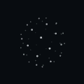

`Mood::Thinking` — 与常规身体同等视觉尺度的醒目纵深点阵，以 1.6 秒基础周期旋转呼吸，纬度波动依次传递。 A full-body-scale shell of bold depth-shaded points turns through a brisk 1.6-second latitude-delayed breathing cycle.

### Speaking · 说话


`Mood::Speaking` — 说话时身体随语音脉动；示例已开启 setTalking(true)。 An engaged face pulses with speech. This example enables setTalking(true).

### Happy · 开心

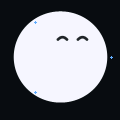

`Mood::Happy` — 圆润弧形笑眼、轻盈上浮，伴随环绕的小光点。 Rounded smiling arches and a buoyant lift, accompanied by small sparkles.

### Sad · 难过

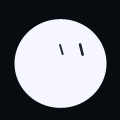

`Mood::Sad` — 身体下沉并略微压扁，半闭的眼睛低垂。 A settled, slightly compressed body and lowered, partly closed eyes.

### Sleepy · 困倦

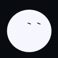

`Mood::Sleepy` — 困倦的细眼、较长眨眼，以及 7.2 秒周期的慢呼吸。 Drowsy narrow eyes with extended blinks and a slow 7.2-second breath.

### Surprised · 惊讶

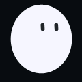

`Mood::Surprised` — 更圆、更大的双眼与快速竖向拉伸，也用于 poke() 的惊讶阶段。 Wide rounded eyes and a quick vertical stretch. Also used by poke().

### Working · 工作

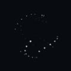

`Mood::Working` — 与常规身体同等视觉尺度的醒目稀疏点阵，以 1.4 秒基础周期沿经线上升，在两极淡出并反向旋转。 A full-body-scale shell of bold sparse points streams upward through a 1.4-second meridian vortex, fading at the poles as it counter-rotates.

### Waiting · 等待


`Mood::Waiting` — 保持清醒的耐心神态，略微歪头，缓慢左右张望。 Patient open eyes, a slight questioning lean and a slow side-to-side search.

### Blocked · 受阻


`Mood::Blocked` — 感叹号替代身体轮廓，轻微抖动提示工作受阻。 An exclamation-mark silhouette with a small glitch rhythm signals a blocker.

### Done · 完成

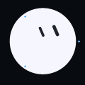

`Mood::Done` — 害羞的低侧目光、轻柔抬升和庆祝光点。 A settled bashful glance, gentle lift and celebratory sparkles.

### Asleep · 熟睡

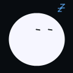

`Mood::Asleep` — 完全闭眼、8.8 秒深呼吸，以及三枚逐渐飘起并淡出的 z 字。 Fully closed sleepy eyes, an 8.8-second breath and three drifting, fading z marks.

### Looking around · 到处看看


`Mood::LookingAround` — 脸部探索完整视线范围，每隔 0.9–2.8 秒平滑转向新目标。 The face explores the complete gaze field, easing through new targets every 0.9–2.8 seconds.

## Expressions

### Auto · 自动


`Expression::Auto` — 跟随当前心情的脸部形态；此处显示空闲状态。 Uses the current mood’s facial geometry; shown here with Idle.

### Neutral · 自然


`Expression::Neutral` — 显式恢复空闲状态的基础眼形，覆盖困倦等心情的闭眼形态。 Explicitly restores Idle’s baseline eye proportions even over resting moods.

### Curious · 好奇


`Expression::Curious` — 睁大双眼、轻轻歪头，并看向右上方。 Wide attentive eyes, a gentle lean and an upper-right glance.

### Focused · 专注

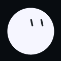

`Expression::Focused` — 收窄双眼、保持对称间距与居中视线。 Calmer narrow eyes with balanced spacing and a centered gaze.

### Joy · 喜悦

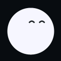

`Expression::Joy` — 双眼通过连续形变变成平滑的笑弧。 Continuously morphs the eyes into smooth smiling arches.

### Skeptical · 怀疑


`Expression::Skeptical` — 轻微反向倾斜、不对称眼形与侧目。 A subtle opposing lean, asymmetric eyes and a sideward glance.

### Bashful · 害羞


`Expression::Bashful` — 略微旋转眼睛，害羞地向下看。 A shy lowered glance with a small rotation of the pair.

### Wink · 眨眼

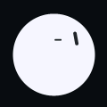

`Expression::Wink` — 一只眼睛沿同一套平滑几何逐渐闭合。 Closes one eye through the same eased capsule geometry.

### Dizzy · 眩晕


`Expression::Dizzy` — 双眼缓慢扭转以表示眩晕，不替换成独立符号。 A slow twisting eye pair suggests disorientation without replacing the glyph.

### Alarmed · 警觉


`Expression::Alarmed` — 更宽、更圆的双眼构成警觉神态。 Wider, rounder eye marks create an alert face.

## Animations

### Auto · 自动


`Animation::Auto` — 按有效心情选择平静、好奇、环绕、弹跳、闪耀或闪动节奏。 Chooses choreography from the effective mood: calm, curious, orbit, bounce, sparkle or glitch.

### Calm · 平静


`Animation::Calm` — 轻柔漂移、呼吸和小幅眼睛旋转。 Gentle drifting, breathing and small eye rotation.

### Curious · 好奇


`Animation::Curious` — 带有好奇感的侧倾，以及细微的水平和竖直移动。 An inquisitive lean with small horizontal and vertical movement.

### Orbit · 环绕


`Animation::Orbit` — 平滑的环绕路径，配合眼睛移动。 A smooth orbital body path with coordinated eye movement.

### Bounce · 弹跳


`Animation::Bounce` — 明显的竖直弹跳，伴随身体压缩和拉伸。 A lively vertical bounce with squash and stretch.

### Glitch · 闪动


`Animation::Glitch` — 短促、幅度有限的抖动，适合受阻状态。 A bounded brief jitter, suitable for the blocked lifecycle.

### Wave · 波浪


`Animation::Wave` — 流畅的左右摇摆与眼睛旋转。 A flowing sideways sway and eye rotation.

### Sparkle · 闪耀

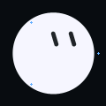

`Animation::Sparkle` — 三个小光点围绕正在呼吸的角色运动。 Three small accent lights circulate around the breathing bot.

## 九方向眼神 · Gaze perspective


上排：左上 / 上 / 右上。中排：左 / 正面 / 右。下排：左下 / 下 / 右下。下看的极限位置更接近中心；Auto 是额外的自主视线模式。

## Composition and controls

Auto follows the effective mood. Thinking and Working replace the avatar with larger depth-shaded point shells; Blocked replaces it with an exclamation. Thinking uses a 1.6-second latitude-delayed base cycle, while Working streams upward through a 1.4-second pole-faded vortex. StopWatch level-two speed and intensity produce approximately 4.0- and 3.5-second cycles. Explicit Neutral cannot restore eyes over these silhouette states. LookingAround explores the complete gaze field; Idle holds the canonical upper-right pose. `setFaceSide()` selects automatic, left or right mirroring.

`setAnimationSpeed(0.25..3)`, `setMotionAmount(0..2)` and `setReducedMotion()` apply to choreography. Zero amount freezes shell and z-mark motion. `gazeAt()` temporarily overrides gaze in Idle or LookingAround. `poke()` runs surprise → happy → prior mood. `setTalking()` controls speech pulsing. Hosts can supply IMU tilt/shake, battery, signal, time, labels, names and bilingual descriptions. Eight curated presets remain compatible.

## Reproduce and validate

From the repository root:

```sh
lib/bot-ux/tools/host-preview/render.sh
./tmp/botux-preview/botux-preview tmp/botux-preview --catalog
python3 lib/bot-ux/tools/host-preview/catalog.py tmp/botux-preview
```

Packaging requires Pillow. The native C++ renderer emits 72 frames per entry at 120×120, 100 ms apart, using fixed blink seed 1234. The packager encodes GIF assets and embeds them into the searchable HTML. Sources are `lib/bot-ux/src/BotUx.{h,cpp}` and `lib/bot-ux/tools/host-preview/`.

The focused harness verifies coverage, pose direction, mirroring, reduced/zero motion, transition continuity, both orb phase wraps and sleep-loop continuity. These are native host renders, not hardware captures. Component AA ellipse/capsule rendering is real; other M5GFX shapes/fonts remain approximations. GIF quantization and a finite repeating capture can introduce sampling or loop artifacts absent from continuous firmware. No device performance claim is made.
